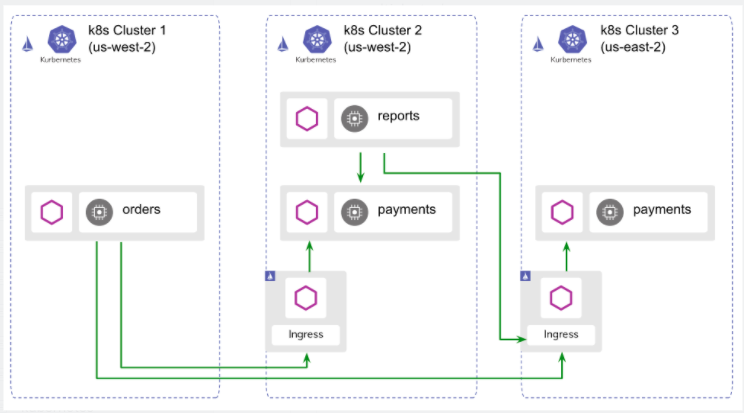

:doctype: book
:author: y4h2
:sectnums:
:chapter-label:
:toc: left
:toclevels: 2
:toc-title: Table of Contents
:icons: font

# Service Mesh

## 学习方法

1. 多做实验
2. 基于案例学习
3. 理解各个Resource之间的联系

## 理解Bookinfo应用
官方的bookinfo，app足够复杂， 官网的所有示例都是基于这个demo的。

## Resources
详细定义查看 https://istio.io/latest/docs/concepts/traffic-management[官方文档]

所有的Istio功能都是基于以下这些CRD的

- Gateways: 允许外部流量进入mesh
- Virtual services : 决定具体路由策略
- Destination rules: 匹配Service和Deployment, 应用LB策略
- Service entries: 在默认阻止访问所有的外部服务时， service entry注册可以访问的外部服务
- Sidecars

### Resource之间的关系

https://istio.io/latest/docs/tasks/traffic-management/ingress/ingress-control/

.Gateway
[source,yaml]
----
apiVersion: networking.istio.io/v1alpha3
kind: Gateway
metadata:
  name: httpbin-gateway
...
----

.Virtual Service
[source,yaml]
----
apiVersion: networking.istio.io/v1alpha3
kind: VirtualService
metadata:
  name: httpbin
spec:
  ...
  gateways:
  - httpbin-gateway         # <1>
  http:
  - match:
    - uri:
        prefix: /headers
    route:
    - destination:
        port:
          number: 8000
        host: httpbin  # <2>

----
<1> bind gateway
<2> 导向具体的service

Gateway允许外部流量进入，Virtual Service绑定Gateway并决定具体的路由策略

.DestinationRule
[source,yaml]
----
apiVersion: networking.istio.io/v1alpha3
kind: DestinationRule
metadata:
  name: productpage
spec:
  host: productpage # <1>
  subsets: 
  - name: v1 
    labels:   # <2>
      version: v1
----
<1> 匹配Service的名字
<2> 匹配Deployment的label

.ServiceEntry
[source,yaml]
----
apiVersion: networking.istio.io/v1alpha3
kind: ServiceEntry
metadata:
  name: httpbin-ext
spec:
  hosts:   # <1>
  - httpbin.org
  ports:
  - number: 80
    name: http
    protocol: HTTP
  resolution: DNS
  location: MESH_EXTERNAL
----
<1> 定义可以访问的外部域名

## Cases

### Traffic Management
https://istio.io/latest/docs/tasks/traffic-management/

- Request Routing
- Fault Injection
- Traffic Shifting
- TCP Traffic Shifting
- Request Timeouts
- Circuit Breaking
- Mirroring
- Locality Load Balancing
- Ingress
- Egress

### Security

- Certificate Management
- Authentication
- Authorization

### Policy Enforcement

- Enabling Rate Limits

### Observability

https://istio.io/latest/docs/tasks/observability/

- Metrics
- Logs
- Distributed Tracing
- Visualizing your Mesh
- Remotely Accessing Telemetry Addons

### Multi Cluster

https://istio.io/latest/docs/setup/install/multicluster/

https://istio.io/latest/blog/2020/multi-cluster-mesh-automation/[Multicluster Istio configuration and service discovery using Admiral]

原生方案

 

Admiral降低了添加新cluster时， 修改配置的成本

## Deployment Requirement

https://istio.io/latest/docs/ops/deployment/requirements/

## Istio Architecture

## Other

Automatic side car injection: set label on namespace `istio-injection=enabled`