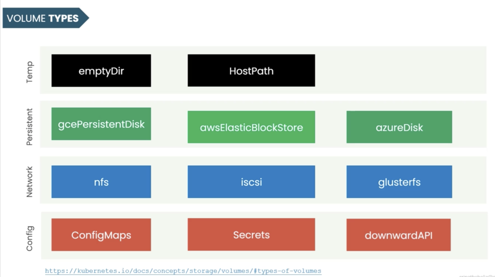
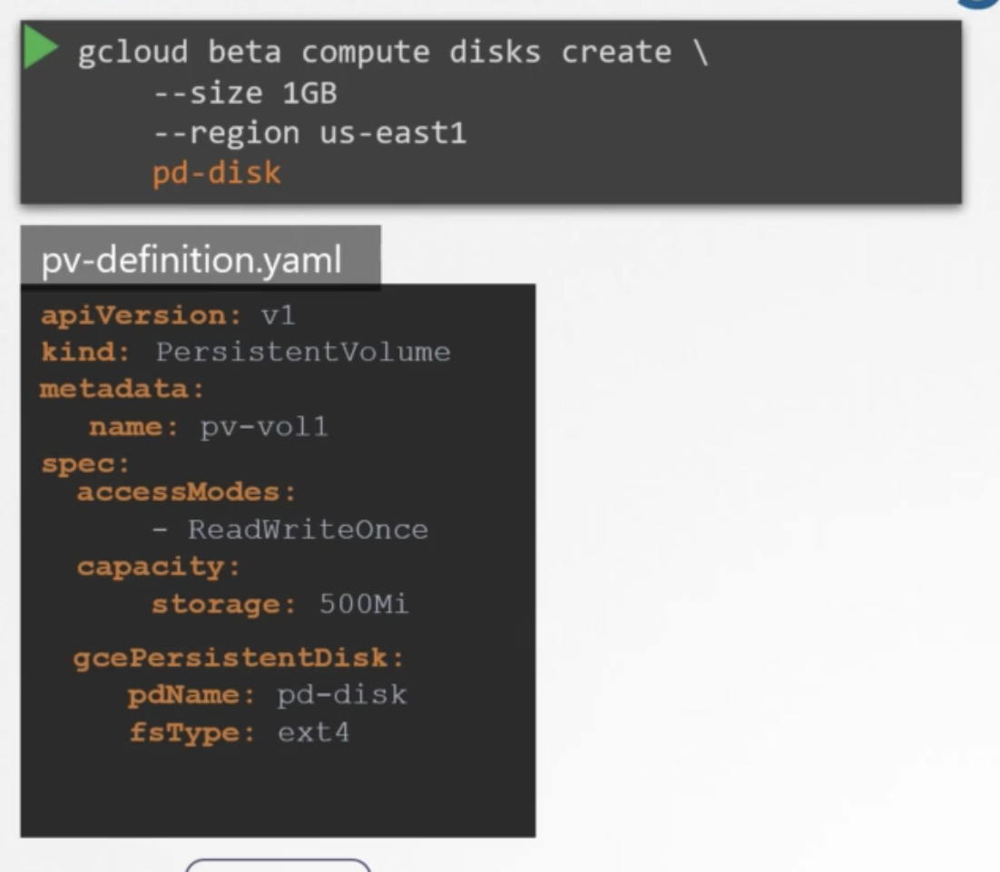
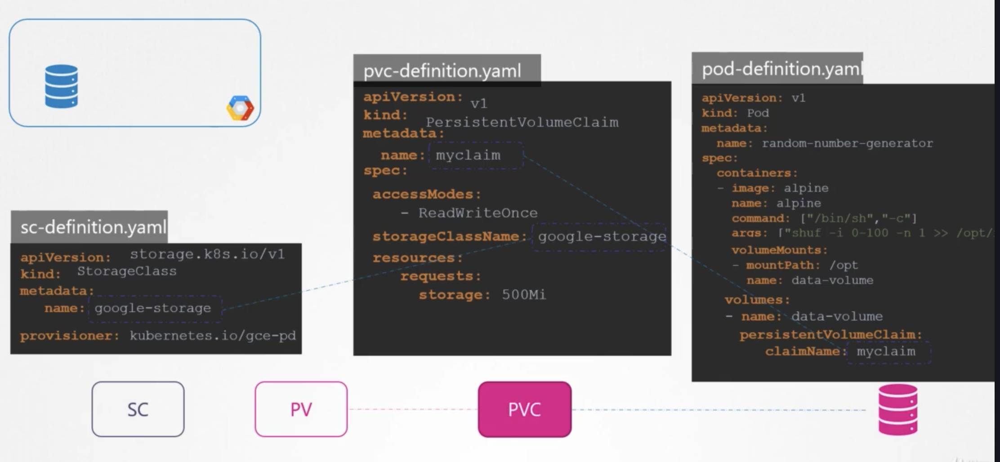

 

Persistent Volume works in minikube

.PVC pending的原因
- 找不到匹配的PV
- 绑定需要pvc和pv是相同的access mode

参数理解

reclaim policy：
retain policy的时候，当和pv绑定的pvc被删除时， pv not deleted and not available. 因为retain policy要求手动释放空间

## Storage Class

pvc的storage class默认为manual

### Static Provisioning

pv使用gce的disk作为存储
 

### Dynamic Provisioning

storage class能自动创建pv,所以我们可以省略pv
 
