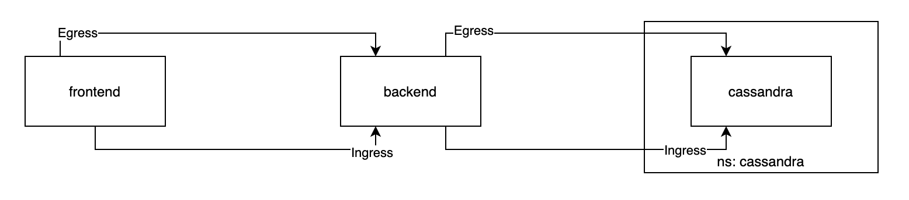
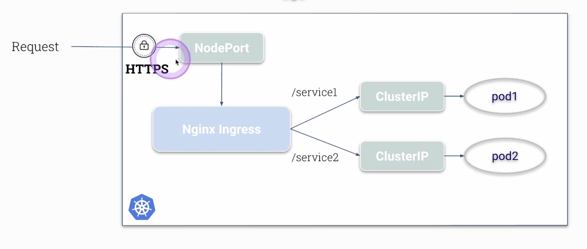
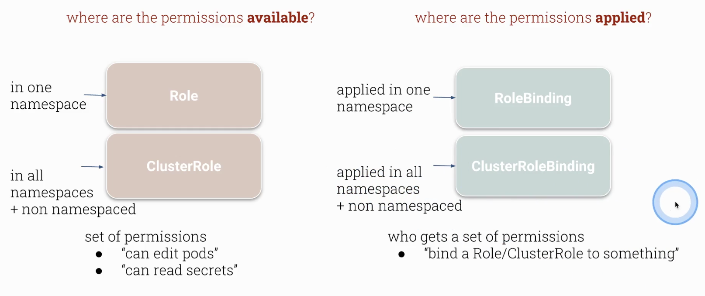
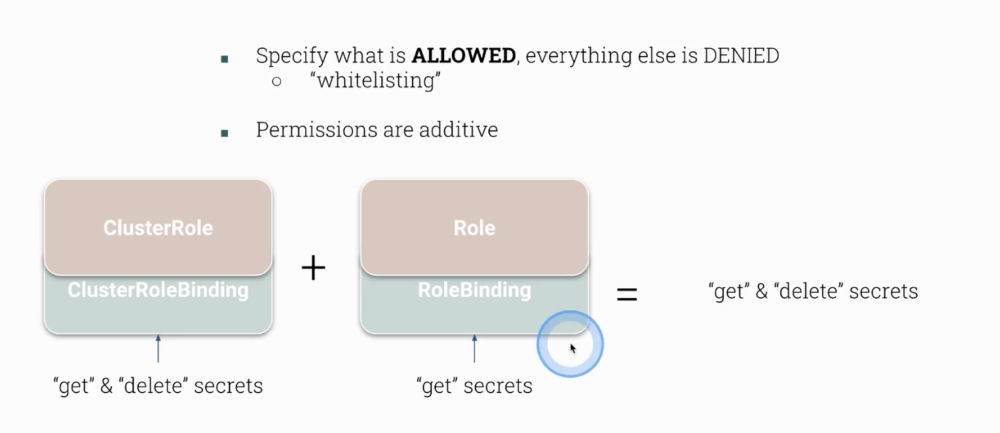
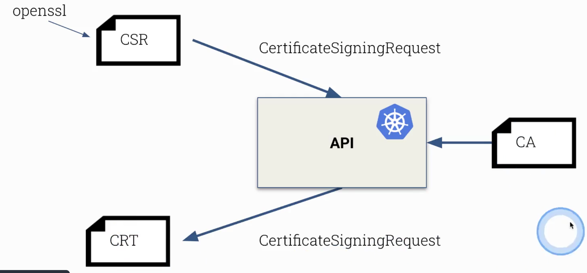

:author: y4h2
:revnumber: v0.1
:revdate: June/26/2021
// :notitle:
:doctype: book
:chapter-label:
:sectnums:
:toc: left
:toclevels: 2
:toc-title: Table of Contents
// :front-cover-image: image::images/cover.jpg[]
:description: This is the description of your boo
:sourcedir: .

# Kubernetes Security

## Network Policy

.Network policy核心
* Default Deny
* Whitelist Allow
* Selector

### SSH to GKE

----
k get nodes -o output

NODE_NAME="gke-cluster-1-default-pool-489a0da5-q0xw" && ZONE="us-central1-c" && \
gcloud compute ssh $NODE_NAME --zone $ZONE
----

Notice: GKE需要手动Enable Kubernetes Network Policy，不然network policy不生效
https://cloud.google.com/kubernetes-engine/docs/tutorials/network-policy#step_1_create_a_cluster
----
gcloud container clusters create test --enable-network-policy
----

### 实验Architecture
* frontend，backend，database都用nginx image
* frontend和backend在default namespace, database在cassandra database
* 配置policy让frontend能访问backend, backend能访问database

 

### 配置方案
.default deny network policy
[source,shell]
----
alias k=kubectl
k
k run frontend --image=nginx
k run backend --image=nginx
k expose pod frontend --port 80
k expose pod backend --port 80
k get pod,svc
k exec frontend -- curl backend
k exec backend -- curl frontend

# apply default deny policy
vim default-deny.yaml
k apply -f deny-default.yaml
k exec frontend -- curl backend
k exec backend -- curl frontend
----

[source,yaml]
.Default Deny
----
include::{sourcedir}/network_policies/default-deny.yaml[]
----

allow traffic from frontend to backend +
注意需要同时设置frontend的egress和backen的ingress
.frontend egress and backend ingress traffic
[source,yaml]
----
include::{sourcedir}/network_policies/frontend-to-backend.yaml[]
----

以上配置不支持DNS，frontend只能通过IP访问backend

----
k get po --show-labels -o wide
NAME       READY   STATUS    RESTARTS   AGE   IP         NODE                                       NOMINATED NODE   READINESS GATES   LABELS
backend    1/1     Running   0          44m   10.4.0.3   gke-cluster-1-default-pool-7e25d214-f8zk   <none>           <none>            run=backend
frontend   1/1     Running   0          44m   10.4.2.4   gke-cluster-1-default-pool-7e25d214-fh8j   <none>           <none>            run=frontend

k exec frontend -- curl 10.4.0.3
----

设置DNS访问
[source,yaml]
----
apiVersion: networking.k8s.io/v1
kind: NetworkPolicy
metadata:
  name: deny
  namespace: default
spec:
  podSelector: {}
  policyTypes:
  - Egress
  - Ingress
  egress:
  - to:
    ports:
      - port: 53
        protocol: TCP
      - port: 53
        protocol: UDP
----

Backend access database

[source,yaml]
----
apiVersion: networking.k8s.io/v1
kind: NetworkPolicy
metadata:
  name: backend
  namespace: default
spec:
  podSelector:
    matchLabels:
      run: backend
  policyTypes:
  - Ingress
  - Egress
  ingress:
  - from:
    - podSelector:
        matchLabels:
          run: frontend
  egress:
  - to: 
    - namespaceSelector:
        matchLabels:
          ns: cassandra
----
不支持DNS，只能通过IP访问

----
k create ns cassandra
k edit ns cassandra # add label ns=cassandra to the namespace

k -n cassandra run cassandra --image=nginx

k apply -f backend.yaml

k exec backend -- curl 10.4.2.5

k get po -n cassandra -o wide
NAME        READY   STATUS    RESTARTS   AGE   IP         NODE                                       NOMINATED NODE   READINESS GATES
cassandra   1/1     Running   0          16m   10.4.2.5   gke-cluster-1-default-pool-7e25d214-fh8j   <none>           <none>
----

Add policy for cassandra namespace
[source,yaml]
----
apiVersion: networking.k8s.io/v1
kind: NetworkPolicy
metadata:
  name: cassandra-deny
  namespace: cassandra
spec:
  podSelector: {}
  policyTypes:
  - Egress
  - Ingress
----

[source,yaml]
----
apiVersion: networking.k8s.io/v1
kind: NetworkPolicy
metadata:
  name: cassandra
  namespace: cassandra
spec:
  podSelector:
    matchLabels:
      run: cassandra
  policyTypes:
  - Ingress
  ingress:
  - from:
    - podSelector:
        matchLabels:
          run: backend
    - namespaceSelector:
        matchLabels:
          ns: default
----

## UI Element

Expose through HTTP

Install databoard

## Secure Ingress

 

部署nginx service

部署k8s ingress resource

secure ingress

## Node Metadata Protection

GCP上node的metadata可以通过访问metadata url获取信息

通过network policy限制pod访问metadata url， 只允许有label meta-accessor的node访问

## CIS Benchmark

CIS： Center for Internet Security

kube-bench

Martin White - Consistent Security Controls through CIS Benchmarks

## Verify Platform Baniries

verify apiserver rbinary running in the cluster
docker cp出来，然后验证

## RBAC

Principle of Least Priveleges

Role: namespaced
ClusterRole: non-namespace
 

Role + RoleBinding
CluterRole + ClusterRoleBinding
ClusterRole + RoleBinding

NOT POSSIBLE: Role + ClusterRolebBinding

### 规则

Permissions are additive!!!

 

Always test your RBAC

.Senario 1
* Create namespaces *red* and *blue*
* User jane can only *get* secrets in namespace *red*
* User jane can only *get* and *list* secrets in namespace *blue*
* Test it using *auth can-i*

.Senario 2
* Create a ClusterRole *deploy-deleter* which allows to delete deployments
* User *jane* can *delete* deployments in *all* namespaces
* User *jim* can *delete* deployments only in namespace *red*
* Test it using *auth can-i*

### Accounts and Users

ServiceAccount: used by service

“Normal User”: a user is someone with a cert and key

CSR - CertificateSigningRequest

 

* There is no way to invalidate a certificate
* If a certificate has been leaked
** Remove all access via RBAC
** Username cannot be used until cert expired
** Create new CA and re-issue all certs

.CSR Senario: Create a certificate+key and authenticate as user jane
* Create CSR
* Sign CST using Kubernetes API
* Use cert+key to connect to k8s API

## ServiceAccount

Use service account to access API service

.显示serviceaccount和对应的token
----
k get sa,secrets

# or
k describe sa default
----

----
k create sa accessor
----

.use accessor service account to run the pod
[source,yaml]
----
apiVersion: v1
kind: Pod
metadata:
  creationTimestamp: null
  labels:
    run: accessor
  name: accessor
spec:
  serviceAccountName: accessor
  containers:
  - image: nginx
    name: accessor
    resources: {}
  dnsPolicy: ClusterFirst
  restartPolicy: Always
status: {}
----

----
k apply -f accessor.yaml

k exec -it accessor -- bash

# inside pod
mount | grep sec
cd /run/secrets/kubernetes.io/serviceaccount
ls
# 这个token是serviceaccount的token
# by default, pod会有serviceaccount的权限
cat token
----

### Disable ServiceAccount Mounting

----
automountServiceAccountToken: false
----

### Limit ServiceAccounts using RBAC
在clusterrolebinding里指定eerviceaccount

## Restrict API Access

* Don't allow anonymous access
* Close insecure port
* Don't expose ApiServer to the outside
* Restrict access from Nodes to API (NodeRestriction)
* Prevent unauthorized access (RBAC)
* Prevent pods from accessing API
* Apiserver port behind firewall / allowed ip ranges (cloud provider)

### Anonymous Access

check API server manifest on master node

### Insecure Access
 after k8s 1.20, insecure access is no longer possible

 ----
 kube-apiserver --insecure-port=8080
 ----

### Manual API Request

### External Apiserver Access

用local的kubectl控制远程的kubernetes集群

link:{sourcedir}/security/external_apiserver_access/conf[Conf]
link:{sourcedir}/security/external_apiserver_access/sample-certificate[certificate]

----
# 修改service kubernetes从ClusterIP编程NodePort
k edit svc kubernetes

# 获取config
k config view --raw

# ===== 切换回local
# 把config复制到local的conf文件中
# 再本地运行
k --kubeconfig conf get ns
# 会报错 Unable to connect to the server: x509: certificate is valid for 10.96.0.1, 172.31.101.121, not 54.218.84.64

# ===== 切换回remote
# 查看certificate的范围
cd /etc/kubernetes/pki
openssl x509 -in apiserver.crt -text

# 可以看到X509v3 Subject Alternative Name里面有DNS和IP Address
# 修改本地的/etc/hosts，添加remote IP和DNS kubernetes的映射
# 再次尝试即可
k --kubeconfig conf get ns
----

### NodeRestriction AdmissionController

----
kube-apiserver --enable-admission-plugins=NodeRestriction
----

Limits the *Node* labels a kubelet can modify

Ensure secure workload isolation via labels

NodeRestriction默认是开启的

----
# 修改master node的label
----

## Upgrade Kubernetes

.How to upgrade a node
* kubectl drain
** safely evict all pods from node
** Mark node as SchedulingDisabled (`kubectl cordon`)
* Do the upgrade
* `Kubectl uncordon`
** Unmark node as SchedulingDisabled

.Make your application survive an upgrade
* Pod gracePeriod/terminating state
* Pod Lifecycle events
* PodDistruptionBudget

### Practice: Upgrade an outdated cluster

用kubeadm升级node