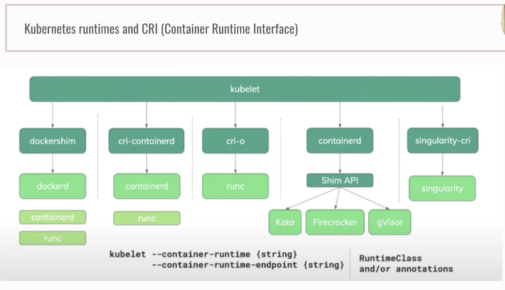
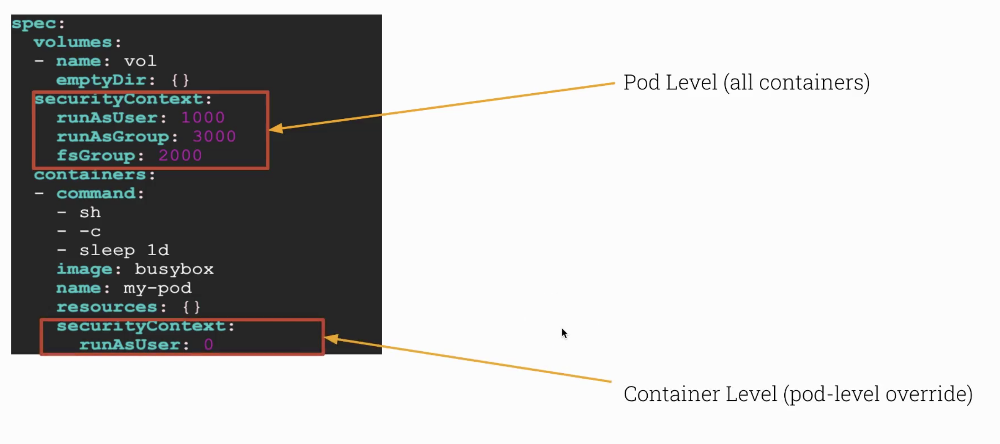
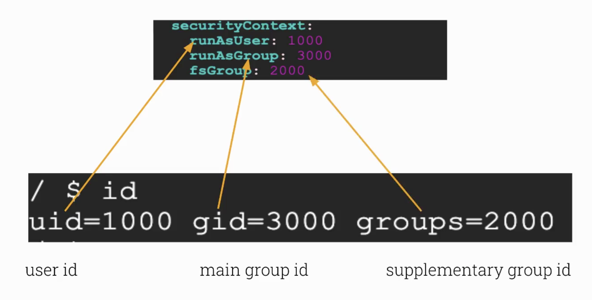
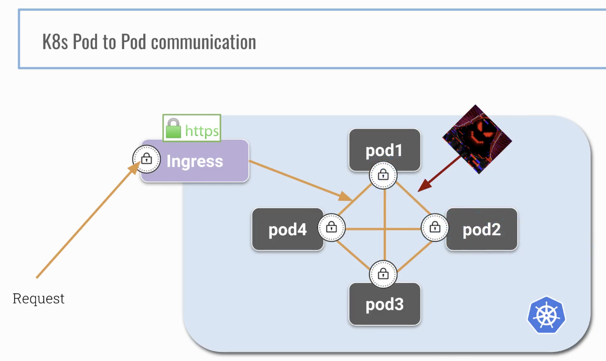
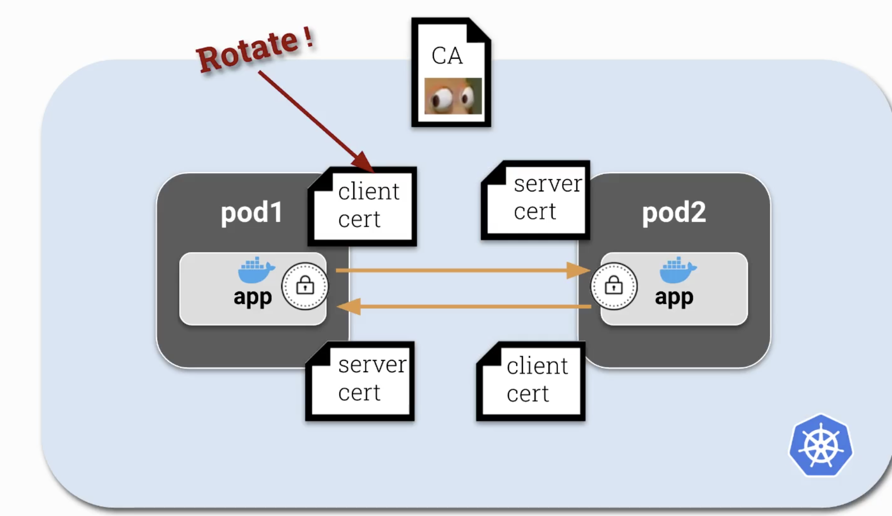
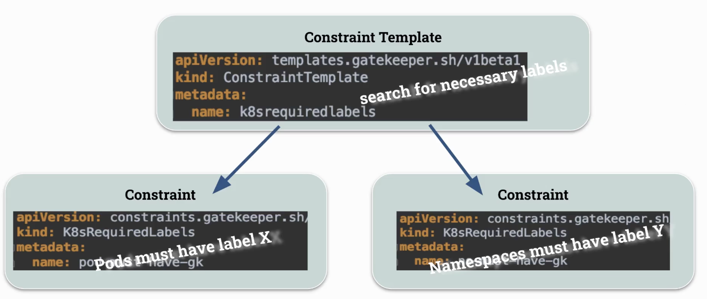

:author: y4h2
:revnumber: v0.1
:revdate: June/26/2021
// :notitle:
:doctype: book
:chapter-label:
:sectnums:
:toc: left
:toclevels: 2
:toc-title: Table of Contents
// :front-cover-image: image::images/cover.jpg[]
:description: This is the description of your boo
:sourcedir: .

# Microservice Vulnerabilities

## Managing Secrets

.Secret关心的问题
* What are Secrets?
* Deploying & Use Secrets
* Hacking Secrets (etcd & docker)
* How Secrets are stored (encrypted)

----
k create secret generic secret1 --from-literal user=admin
k create secret generic secret2 --from-literal pass=12345678
----

.Add the pod yaml with secrets
[source,yaml]
----
include::{sourcedir}/secrets/pod-with-secrets.yaml[]
----

----
k apply -f pod-with-secrets.yaml

$ k exec pod -- env | grep PASS
PASSWORD=12345678

$ k exec pod -- env | grep PASS
PASSWORD=12345678

$ k exec pod -- find /etc/secret1
/etc/secret1
/etc/secret1/..data
/etc/secret1/user
/etc/secret1/..2021_07_05_02_44_41.377000226
/etc/secret1/..2021_07_05_02_44_41.377000226/user

$ k exec pod -- cat /etc/secret1/user
admin
----

### Hack Secrets on Docker

在worker node上面找nginx的docker container  +
在docker inspect中可以看到env中传入的变量
[source,bash]
----
docker ps | grep nginx

docker inspect
----

### Hack Secrets in ETCD

.use etcdctl
[source,bash]
----
$ sudo cat /etc/kubernetes/manifests/kube-apiserver.yaml | grep etcd
    - --etcd-cafile=/etc/kubernetes/pki/etcd/ca.crt
    - --etcd-certfile=/etc/kubernetes/pki/apiserver-etcd-client.crt
    - --etcd-keyfile=/etc/kubernetes/pki/apiserver-etcd-client.key
    - --etcd-servers=https://127.0.0.1:2379

$ sudo ETCDCTL_API=3 etcdctl --cert /etc/kubernetes/pki/apiserver-etcd-client.crt --key /etc/kubernetes/pki/apiserver-etcd-client.key --cacert /etc/kubernetes/pki/etcd/ca.crt endpoint health
127.0.0.1:2379 is healthy: successfully committed proposal: took = 1.405372ms

# get secrets
sudo ETCDCTL_API=3 etcdctl --cert /etc/kubernetes/pki/apiserver-etcd-client.crt --key /etc/kubernetes/pki/apiserver-etcd-client.key --cacert /etc/kubernetes/pki/etcd/ca.crt get /registry/secrets/default/secret2
/registry/secrets/default/secret1

sudo ETCDCTL_API=3 etcdctl --cert /etc/kubernetes/pki/apiserver-etcd-client.crt --key /etc/kubernetes/pki/apiserver-etcd-client.key --cacert /etc/kubernetes/pki/etcd/ca.crt get /registry/secrets/default/secret2
/registry/secrets/default/secret2
----

### etcd encryption

--encryption-provider-config

https://kubernetes.io/docs/tasks/administer-cluster/encrypt-data/

----
apiVersion: apiserver.config.k8s.io/v1
kind: EncryptionConfiguration
resources:
  - resources:
    - secrets
    providers:
    - identity: {}
    - aesgcm:
        keys:
        - name: key1
          secret: c2VjcmV0IGlzIHNlY3VyZQ==
        - name: key2
          secret: dGhpcyBpcyBwYXNzd29yZA==
    - aescbc:
        keys:
        - name: key1
          secret: c2VjcmV0IGlzIHNlY3VyZQ==
        - name: key2
          secret: dGhpcyBpcyBwYXNzd29yZA==
    - secretbox:
        keys:
        - name: key1
          secret: YWJjZGVmZ2hpamtsbW5vcHFyc3R1dnd4eXoxMjM0NTY=
----

Practice

generate key `head -c 32 /dev/urandom | base64`

etcd encryption config
[source,yaml]
----
apiVersion: apiserver.config.k8s.io/v1
kind: EncryptionConfiguration
resources:
  - resources:
    - secrets
    providers:
    - aescbc:
        keys:
        - name: key1
          secret: JsGE/UioDcpqHfSrYCFTknIM1P1Bh7RfIasw30zwwGU=
    - identity: {}
----

update kube-apiserver.yaml
----
- --encryption-provider-config=/etc/kubernetes/etcd/ec.yaml

# in volume mount section
    - mountPath: /etc/kubernetes/etcd
      name: etcd
      readOnly: true

# in volumes section
  - hostPath:
      path: /etc/kubernetes/etcd
      type: DirectoryOrCreate
    name: etcd

----

after apply the encryption, try the secret again
----
$ k create secret generic very-secure --from-literal cc=1234
secret/very-secure created

$ sudo ETCDCTL_API=3 etcdctl --cert /etc/kubernetes/pki/apiserver-etcd-client.crt --key /etc/kubernetes/pki/apiserver-etcd-client.key --cacert /etc/kubernetes/pki/etcd/ca.crt get /registry/secrets/default/very-secure
/registry/secrets/default/very-secure
k8s:enc:aescbc:v1:key1:n������ˬ�e�z<�*�Q(��X���W���[
                                                    P^����x��@-wz2?��@3q0~
                                                                          f֣k1~X�А]�$�����zC\�����T�ʁk5<�����b:[j+6�2�[�ܦ8�}i|��PҩV��0)P�E5$�S��       �58�FI*��rL�(\�ߺ,cR2�$����%'�%����yuza�6w,r���P�%�q*B?�RB�W�\��c��H�c3,
----

.更新所有的secret
----
k get secret -A -oyaml | kubectl replace -f -
----

Troubleshooting: 秘钥长度不匹配

check apiserver log
----
$ sudo cat /var/log/pods/kube-system_kube-apiserver-06090f55201c.mylabserver.com_f00bf7ce9a271453efae81aadac6ca7f/kube-apiserver/6.log

{"log":"Error: error while parsing encryption provider configuration file \"/etc/kubernetes/etcd/ec.yaml\": error while parsing file: resources[0].providers[0].aescbc.keys[0].secret: Invalid value: \"REDACTED\": secret is not of the expected length, got 17, expected one of [16 24 32]\n","stream":"stderr","time":"2021-07-05T03:56:55.13730761Z"}
----

`sudo systemctl restart kubelet`
可以重启k8s apiserver

Resources:
* Base64 is not encryption A better storuy for Kubernetes Secrets
* Build Secure Apps Faster Without Secrets

## Container runtime sandboxes

Contact the Linux Kernel from inside a container

Dirty cow

 

crictl: provides a CLI for CRI-compatible container runtimes

kata containers

gVisor: 
* simulates kernel syscalls with limited functionality
* runsc

### RuntimeClasses

.gVisor RuntimeClass
[source,yaml]
----
include::{sourcedir}/container_runtime/rc.yaml[]
----

----
k apply -f rc.yaml

k run gvisor --image=nginx -oyaml --dry-run=client > pod.yaml

# modify the pod

k create -f pod.yaml
----

.run a pod with runtime class
----
apiVersion: v1
kind: Pod
metadata:
  creationTimestamp: null
  labels:
    run: gvisor
  name: gvisor
spec:
  runtimeClassName: gvisor
  containers:
  - image: nginx
    name: gvisor
    resources: {}
  dnsPolicy: ClusterFirst
  restartPolicy: Always
status: {}
----

Resource
* Kata Containers An introduction and overview

## OS Level Security Domains

### Security Contexts

 

 

* Set Container User and Group
* Force Container Non-Root
* Privileged Containers
* PrivilegeEscalation
* Disable PrivilegeEscalation

### Pod Security Policies

control the security context

need change apiserver configuration

issue: after apply the PodSecurityPolicy, we cannout deploy deployment, but we are able to run pod.

*Deployment is managed by service account*

所以创建对应的role的role binding就行了

----
k create role psp-access --verb=use --resource=podsecuritypolicies

k create rolebinding psp-access --role=psp-access --serviceaccount=default:default
----

## mTLS - Mutual TLS

主要作用于Pop间的通信

 

 

### Practice: Create a Proxy sidecar which with NET_ADMIN capability

.Resource
* Demystifying Istio's Sidecar Injection Model

## Open Policy Agent

 

OPA Gatekeeper CRD

### Practice: Deny All Policy
### Practice: Enforce namespace labels
### Practice: enforce Deployment replica count

### Practice: the rego playground and more examples

https://play.openpolicyagent.org/

.Resources
* Policing Your Kubernetes Clusters with Open Policy Agent (OPA)
