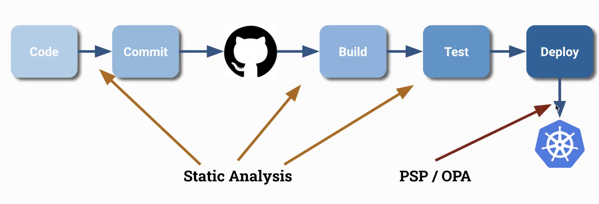
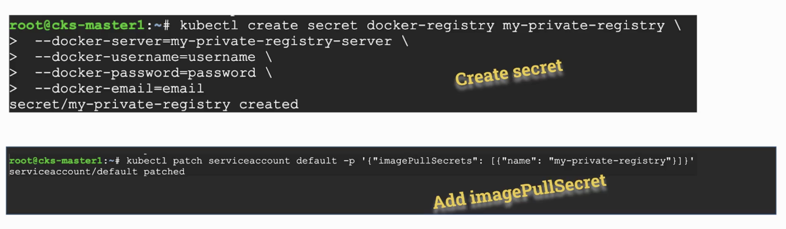

# Supply Chain Security

.Secure and hardening Images
. Use specific package versions (no latest)
. Don't run as root
. Make filesystem read only
. Remove shell access

.Dockerfile
[source,dockerfile]
----
# build container stage 1
FROM ubuntu:20.04
ARG DEBIAN_FRONTEND=noninteractive
RUN apt-get update && apt-get install -y golang-go=2:1.13~1ubuntu2
COPY app.go .
RUN pwd
RUN CGO_ENABLED=0 go build app.go

# app container stage 2
FROM alpine:3.12.0         # <1>
RUN addgroup -S appgroup && adduser -S appuser -G appgroup -h /home/appuser
RUN rm -rf /bin/*   # <3>
COPY --from=0 /app /home/appuser/
USER appuser #  <2>
CMD ["/home/appuser/app"]
----
<1> specific version
<2> no root
<3> no shell access

.Resource
* https://docs.docker.com/develop/develop-images/dockerfile_best-practices/[Docker Best Practices]

## Static Analysis

static analysis in CI/CD

 

Kubesec: do the static analysis

https://github.com/controlplaneio/kubesec

----
docker run -i kubesec/kubesec:512c5e0 scan /dev/stdin < kubesec-test.yaml
----

OPA conftest: check yaml

## Image Vulnerability Scanning

Clair

Trivy

## Secure Supply Chain

Private Registry with Kubernetes

 

ImagePolicyWebhook

